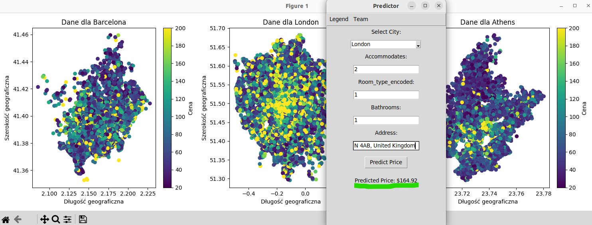
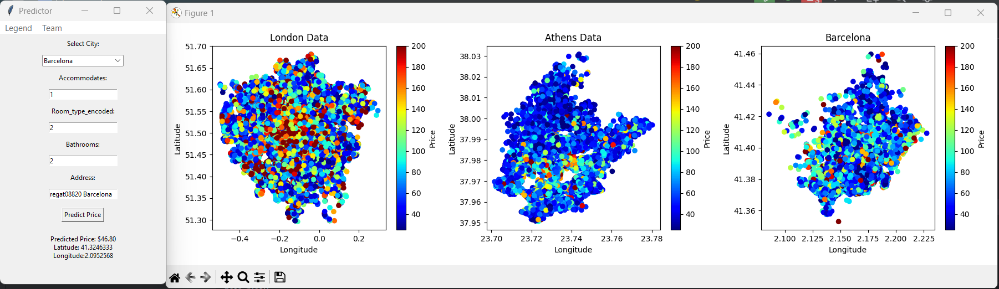
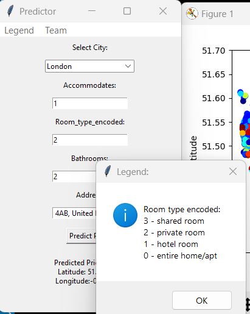

# AirRNB

## QUICKLY PREPARED PROGRAM FOR SHOW RNB PROJECT 

## FOR LODGIFY ;)

Program predicts a price for one night in various location.

Three cities were added for prediction: London, Athens and Barcelona.

Data is taken from AirRNB.

I saw Lodgify is searching for machine learning/deep learning/AI engineer and

as a fast-growing company leading the vacation rental industry with innovative 

software... I thought to prepare in the morning short program which will 

calculate rental prices using ML. I didn't have much time before push kids to

the kindergarten... ;)

I have checked couple machine learning alghoritms and used XGBoost (regression)

Check 2407-change-into-object-oriented-paradigm branch (you will see git log

- how I've changed script into object oriented program).

(**All the effort took about 5 hours**)

### 1. Check for Python Installation

Ensure you have Python installed on your system. Most Linux distributions

come with Python pre-installed. You can check the installed Python version by 

running in Linux:

```bash
python3 --version
```

If Python is not installed or you need a different version, you can typically 

install it using your distribution's package manager. For example, on Ubuntu 

or Debian-based systems, you can install Python 3 using:

```bash
sudo apt update
sudo apt install python3
```

### 2. Install Required Libraries

Application requires several libraries, such as `pandas`, `numpy`, `xgboost`, 

and `tkinter`. You can install these using `pip`, Python's package installer. 

Run the following command to install the required libraries:

```bash
pip3 install pandas numpy xgboost tk scikit-learn geopy matplotlib 
```

Note: `tkinter` might already be installed with Python. If not, you can 

install it via your Linux distribution's package manager. For example, 

on Ubuntu, you can install it with:

```bash
sudo apt-get install python3-tk
```

### 3. Running Application

Navigate to the directory containing application files in the terminal. 

If application entry point is `main.py` (which includes the instantiation of 

your `GUI` class and calls the `run_gui` method), run the application with:

```bash
python3 main.py
```

This command starts your application, and you should see the GUI window 

appear on your screen.

### 4. Interact with Your Application

Now that your application is running, you can test its functionalities:

- Select a city from the dropdown menu.

- Enter the required input values in the text fields.

- Click the "Predict Price" button to see how the application responds,

  including displaying the predicted price and any error messages.

### 4. Optional: Creating a Virtual Environment

For better management of your project's dependencies, consider using a 

virtual environment. This isolates your project's libraries from the global

Python installation. To create and activate a virtual environment, use:

```bash
python3 -m venv myprojectenv
source myprojectenv/bin/activate
```

After activation, any Python or pip commands will use the versions in 

the virtual environment rather than the global ones.


## SCREENSHOTS

XGBRegressor Linux TK



XGBRegressor for Barcelona



XGBRegressor for London


Help




## FUTURE UPDATES

- add multithreading - I hate slowness of this app (unfortunatelly 

  data is loaded directly from website and it is huge csv for every

  city :/ - data transformation takes some time, but we will handle!) 

- unit tests and test cases for application - oh, no.. seems I will

  be busy as the devil in the hell ;)

- add other Machine Learning algorithms (yeah! - this is what we would

  like to have possibility to choose and check how good each alghoritm

  is for the same city)
